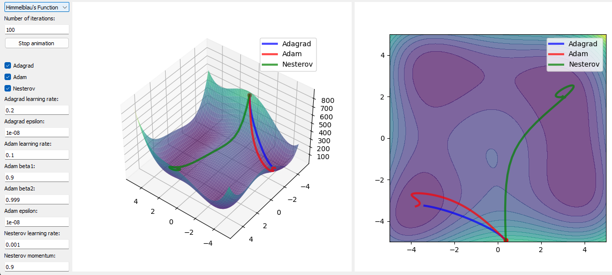

# Gradient Descent Visualizer App



This app visualizes various gradient descent optimizers to demonstrate their behavior and efficiency in minimizing functions. I hope it serves as an educational tool for understanding the dynamics of different optimization algorithms.

## Optimizers Overview

### Adam
- **Description:** Combines ideas from RMSprop and Momentum, adjusting learning rates based on a moving average of recent gradients. It's efficient for large datasets and complex problems.
- **Strengths:** Robust and fast convergence.
- **Weaknesses:** Requires tuning of hyperparameters.
- **Equation:** 
$$\theta_{\text{next}} = \theta - \frac{\alpha}{\sqrt{\hat{v}_t} + \epsilon} \hat{m}_t$$
- **Definitions:**
  - $\theta$ : Parameters to optimize.
  - $\alpha$` : Learning rate.
  - $\hat{m}_t$ : Bias-corrected exponentially weighted average of past gradients.
  - $\hat{v}_t$ : Bias-corrected exponentially weighted average of the squares of past gradients.
  - $\epsilon$ : Small epsilon value to prevent division by zero.

### Adagrad
- **Description:** Adapts the learning rate for each parameter, useful for dealing with sparse data.
- **Strengths:** Eliminates the need to manually tune the learning rate.
- **Weaknesses:** The continuously decreasing learning rate can lead to premature convergence.
- **Equation:** 
$$\theta_{\text{next}} = \theta - \frac{\alpha}{\sqrt{G_t + \epsilon}} \odot \nabla f(\theta)$$
- **Definitions:**
  - $G_t$ : Sum of the squares of the past gradients.

### Nesterov Accelerated Gradient (NAG)
- **Description:** Improves upon Momentum by considering the future gradient. Faster convergence by correcting the direction more smartly.
- **Strengths:** Faster convergence than Momentum.
- **Weaknesses:** More complex to implement and tune.
- **Equation:** 
$$v_{t} = \gamma v_{t-1} + \alpha \nabla f(\theta - \gamma v_{t-1}), \theta_{\text{next}} = \theta - v_{t}$$
- **Definitions:**
  - $v_t$ : Current velocity.
  - $\gamma$ : Momentum factor.

## Set-Up

To set up and run the Gradient Descent Visualizer App, follow these steps:

1. **Clone the Repository:** Clone the app repository from GitHub to your local machine.
   ```
   git clone <repository-url>
   ```
2. **Create a Conda Environment:** Navigate to the cloned repository directory and create a Conda environment using the `environment.yml` file.
   ```
   conda env create -f environment.yml
   ```
3. **Activate the Conda Environment:** Once the environment is created, activate it.
   ```
   conda activate <env-name>
   ```

Ensure you replace `<repository-url>` and `<env-name>` with the actual URL of this GitHub repository and the name of the created Conda environment, respectively.


